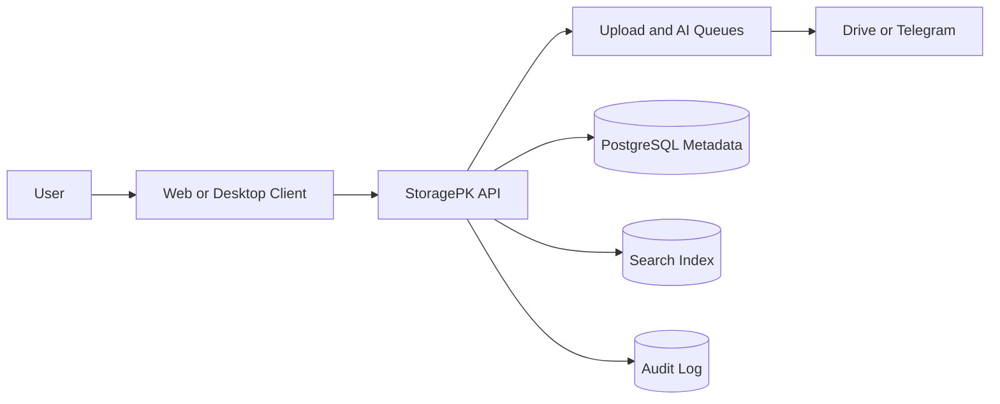

# 00 - Overview

## Purpose

Define StoragePK as a replacement layer for manual cloud-drive organization.

## Scope

This overview covers the product boundary, core system model, high-level workflow, and provider assumptions.

## Responsibilities

- Explain the app in one coherent model.
- Name the main subsystems before deeper docs expand them.
- Establish the difference between file bytes, metadata, classification, and provider locations.

## Assumptions

- Users want to drag files once and let StoragePK organize, upload, index, and remember them.
- File bytes are stored in external providers such as Google Drive or Telegram, while StoragePK owns metadata, classification, search index, audit history, and sync state.
- Desktop and web clients share the same API and design system.

## Dependencies

- [architecture/system-overview.md](architecture/system-overview.md)
- [database/schema.md](database/schema.md)
- [api/resources.md](api/resources.md)
- [frontend/pages.md](frontend/pages.md)

## Detailed Explanation

StoragePK is a personal file operating system. A user drops files into the desktop or web client. The client creates an intake session, uploads files to the backend, and the backend performs checksum calculation, deduplication, content extraction, classification, provider upload, and search indexing.

The system stores files under logical structures such as workspace, collection, folder, tag, smart rule, and timeline. The physical provider path can differ from the logical structure because Google Drive and Telegram have different APIs, limits, and reliability profiles.

## Edge Cases

- Duplicate file content should create a new logical resource only when the user intends separate organization.
- Provider upload success with metadata failure must be reconciled by a repair job.
- Web drag-and-drop may be interrupted by browser refresh; resumable sessions must preserve progress.
- Telegram provider may reject files above its configured limit; the system must route to Drive or split into documented chunks only when allowed.

## Future Considerations

- Add S3-compatible storage as a first-class provider.
- Add local encrypted vault mode for offline-first desktop usage.
- Add multi-user workspaces and shared collections after the single-user MVP stabilizes.

