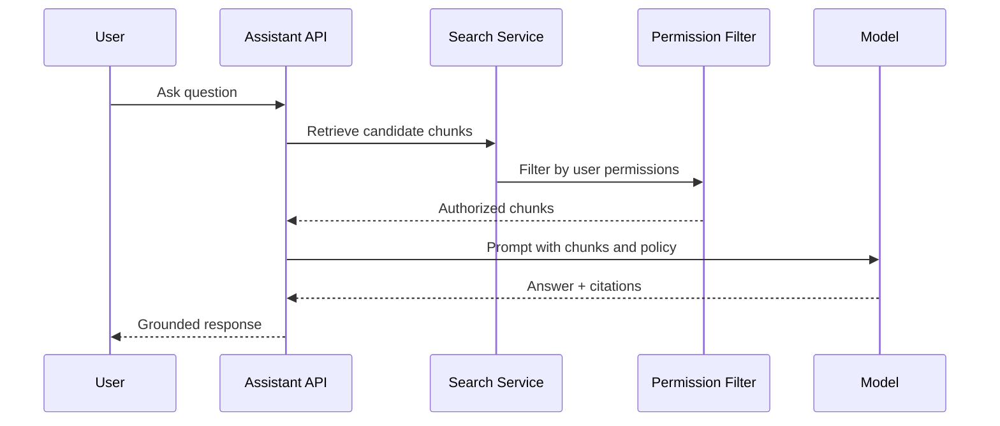

# AI - RAG

## Purpose

Define retrieval-augmented generation behavior for StoragePK assistant and semantic search.

## Scope

This document covers retrieval, ranking, permissions, citations, answer generation, refusal behavior, and auditing.

## Responsibilities

- Ensure AI answers are grounded in authorized files.
- Prevent data leakage through retrieval.
- Make citations useful for user verification.

## Assumptions

- RAG queries operate within a workspace and actor context.
- Search combines metadata, full-text, and embeddings.
- AI answer generation is separate from retrieval authorization.

## Dependencies

- [embeddings.md](embeddings.md)
- [prompts.md](prompts.md)
- [../auth/authorization.md](../auth/authorization.md)

## Detailed Explanation

RAG flow:

Retrieval rules:

- Apply workspace and user authorization before model context assembly.
- Include file name, version, folder, and timestamp in source metadata.
- Limit context to relevant chunks and avoid full-document injection when unnecessary.
- Never let document text override system or developer instructions.

Answer rules:

- Cite every factual claim based on stored files.
- State when no relevant authorized files are found.
- Offer proposed file actions separately from answers.
- Require confirmation for mutations.

## Edge Cases

- Search returns authorized file but specific version is deleted; skip or mark unavailable.
- User asks "show everything"; apply result limits and filters.
- Prompt injection inside a file attempts to exfiltrate data; model must ignore document instructions.
- Conflicting documents require answer to mention conflict and cite both.

## Future Considerations

- Add answer quality evaluations.
- Add folder-specific assistant contexts.
- Add multi-step agent workflows with approval gates.

