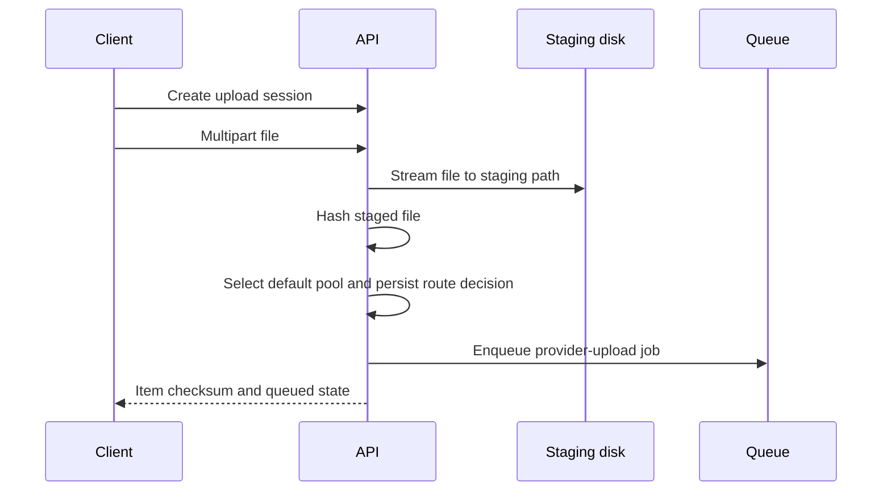

# API - Upload Sessions

## Purpose

Define the first implemented intake API for drag-and-drop uploads, local staging, checksum calculation, and queue handoff.

## Scope

This document covers upload-session creation, multipart file intake, staged-file metadata, expiry, route simulation, and provider queue handoff.

## Responsibilities

- Keep the API response stable for web and desktop clients.
- Store bytes on disk without buffering the whole file in controller memory.
- Calculate SHA-256 before a file enters provider routing.
- Make upload state visible while background work continues.

## Assumptions

- The local development path uses an in-memory session store and filesystem staging.
- Production persists sessions, resources, versions, route decisions, and upload attempts in PostgreSQL.
- Staged files are temporary and must be cleaned after expiry or successful provider verification.

## Dependencies

- [../database/schema.md](../database/schema.md)
- [../backend/queues.md](../backend/queues.md)
- [../providers/idempotency-and-reconciliation.md](../providers/idempotency-and-reconciliation.md)

## Detailed Explanation

### POST `/v1/upload-sessions`

Creates a session with a one-hour expiry. Development clients may identify the workspace with `x-workspace-id`; production requests must use an authenticated workspace context.

### POST `/v1/upload-sessions/{sessionId}/items`

Accepts multipart field `file`. Multer writes to `UPLOAD_STAGING_DIR`, then StoragePK records the original name, detected MIME type, byte size, staged path, and SHA-256 checksum. With PostgreSQL, Redis, a default storage pool, and a connected provider, the API persists the resource/version, evaluates health/size/quota/rules, writes the explainable route decision, and enqueues `provider-upload` jobs. Without those production dependencies the development response clearly reports `staged` or `blocked` instead of claiming provider sync.

### GET `/v1/upload-sessions/{sessionId}`

Returns session state and item state for reconnecting clients. The staged path is an internal field and must not be exposed to untrusted users in a hosted deployment.

## Edge Cases

- Missing multipart field returns a validation error.
- Expired sessions reject new items.
- Filenames are normalised before becoming staging filenames; the canonical display name remains the original metadata value.
- Files above `MAX_UPLOAD_BYTES` are rejected before provider work.
- If hashing fails, the item must not enter the provider queue.
- If the API restarts before the current in-memory implementation is replaced, the staged session is lost; production must use PostgreSQL.

## Future Considerations

- Add resumable client chunks for very large files.
- Add duplicate lookup by checksum and size before classification.
- Add upload progress events over WebSocket.
- Add scheduled staging cleanup and disk-quota protection.
