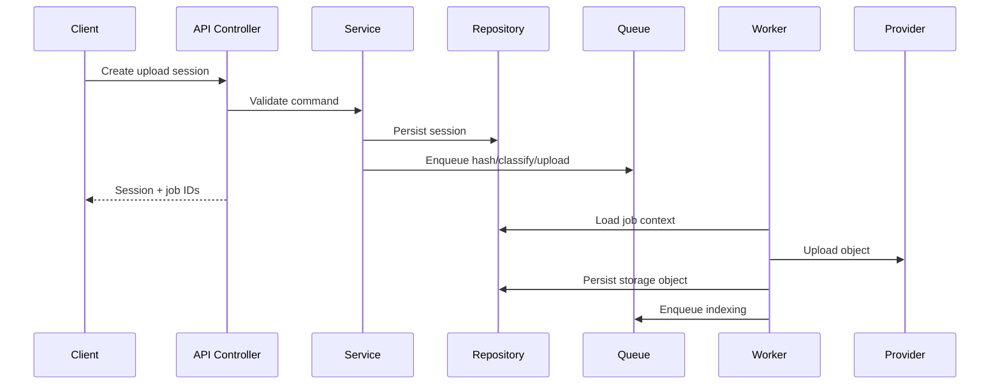

# Architecture - Backend Architecture

## Purpose

Define backend services, modules, responsibilities, integration boundaries, and runtime behavior.

## Scope

This document covers API gateway, services, repositories, queues, workers, events, provider adapters, search, AI, logging, and operational boundaries.

## Responsibilities

- Provide a buildable backend map.
- Keep business logic out of controllers.
- Ensure provider integrations are isolated and testable.

## Assumptions

- Backend is a modular NestJS application or equivalent TypeScript service architecture.
- PostgreSQL is the canonical metadata database.
- Redis powers queues, cache, rate limiting, and realtime fanout.
- Workers can scale independently from API servers.

## Dependencies

- [../backend/services.md](../backend/services.md)
- [../backend/repositories.md](../backend/repositories.md)
- [../backend/queues.md](../backend/queues.md)
- [../api/error-handling.md](../api/error-handling.md)

## Detailed Explanation

Backend modules:

| Module | Responsibility |
| --- | --- |
| Auth | Login, refresh, devices, sessions, revocation. |
| Users | Profiles, preferences, workspace membership. |
| Provider Accounts | OAuth tokens, Telegram bot config, quota, health. |
| Intake | Upload sessions, checksums, queue creation. |
| Resources | Files, versions, folders, tags, collections, soft delete. |
| Classification | Rule-based and AI-assisted metadata suggestions. |
| Search | Query parsing, index writes, permissions filtering. |
| AI | RAG, prompt policy, citation generation, AI audit. |
| Audit | Append-only event records. |
| Admin | Health, repair, dead-letter queues, policy settings. |

### Request Flow

### Service Rules

- Controllers validate transport shape and delegate commands.
- Services enforce business rules and permission checks.
- Repositories perform database access and transaction composition.
- Provider adapters perform external API calls and translate provider errors.
- Workers own long-running work and must be idempotent.

## Edge Cases

- Workers must handle repeated job execution without duplicate provider writes when possible.
- API and worker deployments may run different versions briefly; job payloads must be versioned.
- Provider throttling must translate to retryable job state, not generic failure.
- Long upload sessions must expire and clean staged bytes.

## Future Considerations

- Split provider workers into separate services when throughput grows.
- Add event bus for cross-service integration if modular monolith becomes too large.
- Add CQRS read models for high-volume search and activity feeds.

