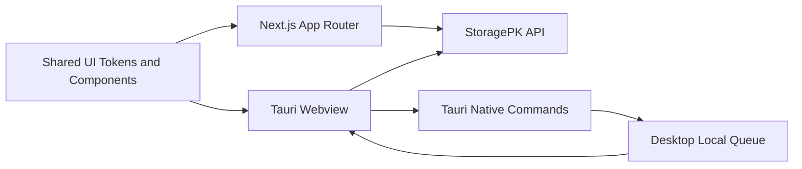

# Architecture - Frontend Architecture

## Purpose

Define how the web and desktop clients are structured, how they share UI concepts, and how they communicate with the backend.

## Scope

This document covers Next.js web architecture, Tauri desktop architecture, shared design system, client state, upload UX, offline behavior, and accessibility boundaries.

## Responsibilities

- Ensure web and desktop clients behave consistently.
- Define where UI state ends and server authority begins.
- Establish patterns for upload progress, optimistic updates, and error recovery.

## Assumptions

- Web client uses Next.js with TypeScript.
- Desktop client uses Tauri with a webview frontend and Rust/native shell capabilities.
- Shared UI components and design tokens live in a future `packages/ui` workspace.
- Clients never store provider secrets directly.

## Dependencies

- [../frontend/routing.md](../frontend/routing.md)
- [../frontend/components.md](../frontend/components.md)
- [../frontend/design-system.md](../frontend/design-system.md)
- [../api/resources.md](../api/resources.md)

## Detailed Explanation

The frontend is an operational interface, not a marketing site. The first screen after authentication is the dashboard with upload drop zone, queue health, recent files, classification suggestions, and provider status.

### Client State Layers

| Layer | Contents | Storage |
| --- | --- | --- |
| Server cache | File lists, provider status, user profile, search results. | Query cache with invalidation. |
| UI state | Open drawers, selected rows, filters, layout mode. | Memory and URL state. |
| Upload state | Per-file progress, pause, retry, cancel, local path. | Server upload session plus desktop local queue. |
| Preferences | Theme, table columns, default provider, density. | Backend profile and local fallback. |

### Desktop-Specific Boundaries

Desktop may support folder drag, background upload, tray status, file-system watching, and local queue persistence. The desktop app must submit metadata to the same API as web and must not write canonical metadata locally without later server reconciliation.

### UI Data Flow

1. Client creates intake session.
2. Client uploads file chunks or streams file to backend.
3. API returns resource and job IDs.
4. Client subscribes to WebSocket/SSE job events.
5. Client invalidates file lists after terminal job state.
6. User edits metadata through resource API, not local-only state.

## Edge Cases

- Browser reload during upload: restore server-side session and mark local file as needing user re-selection if browser security blocks path reuse.
- Desktop window closed during upload: tray continues progress and sends native notification.
- Lost WebSocket connection: poll job endpoint until realtime resumes.
- User bulk-selects files while search query changes: selection must be scoped to the current result set and confirmed before destructive actions.

## Future Considerations

- Add mobile companion with same API contracts.
- Add offline-first metadata editing with conflict resolution.
- Add browser extension for "save to StoragePK" from pages.

