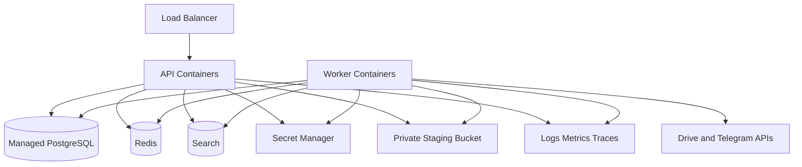

# Architecture - Infrastructure

## Purpose

Define infrastructure components required to run StoragePK in local, staging, and production environments.

## Scope

This document covers compute, databases, queues, search, secrets, storage staging, networking, observability, backups, and provider connectivity.

## Responsibilities

- Provide a production deployment target.
- Document operational dependencies.
- Establish environment isolation and recovery expectations.

## Assumptions

- Backend services are containerized.
- PostgreSQL is managed in staging and production.
- Redis is managed or containerized depending on environment.
- Provider credentials are stored in a secret manager or encrypted DB vault.

## Dependencies

- [../deployment/environments.md](../deployment/environments.md)
- [../deployment/docker.md](../deployment/docker.md)
- [../deployment/cloud.md](../deployment/cloud.md)
- [../deployment/monitoring.md](../deployment/monitoring.md)

## Detailed Explanation

Infrastructure components:

| Component | Local | Staging | Production |
| --- | --- | --- | --- |
| API | Docker or local Node | Container service | Autoscaled container service |
| Worker | Docker or local Node | Container service | Independently scaled workers |
| PostgreSQL | Docker | Managed DB | Managed DB with backups |
| Redis | Docker | Managed Redis | Managed Redis with persistence policy |
| Search | Local OpenSearch/Meilisearch | Managed or container | Managed search cluster |
| Secrets | `.env` | Secret manager | Secret manager with rotation |
| Staging bytes | Local temp folder | Private object bucket | Private object bucket |
| Logs | Console | Central logs | Central logs and alerts |

## Edge Cases

- Redis outage pauses job execution; API should still serve read-only metadata when possible.
- Search outage degrades to database-backed metadata search.
- Secret manager outage prevents provider operations but must not expose cached secrets in logs.
- Staging bucket cleanup failure can increase cost; cleanup jobs need alerts.

## Future Considerations

- Terraform or Pulumi infrastructure as code.
- Multi-region read replicas for metadata.
- Dedicated malware scanning sandbox.
- Private connectivity for managed services.

