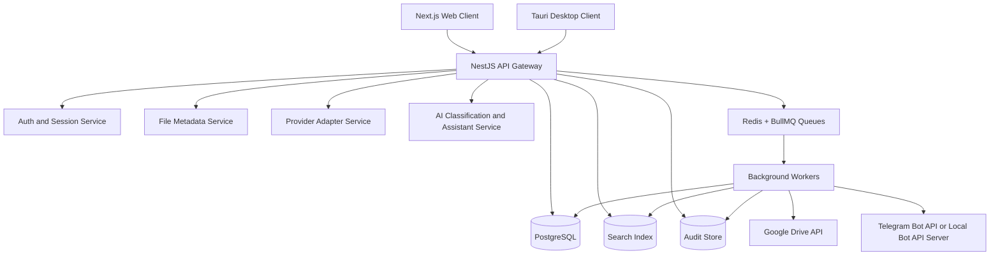
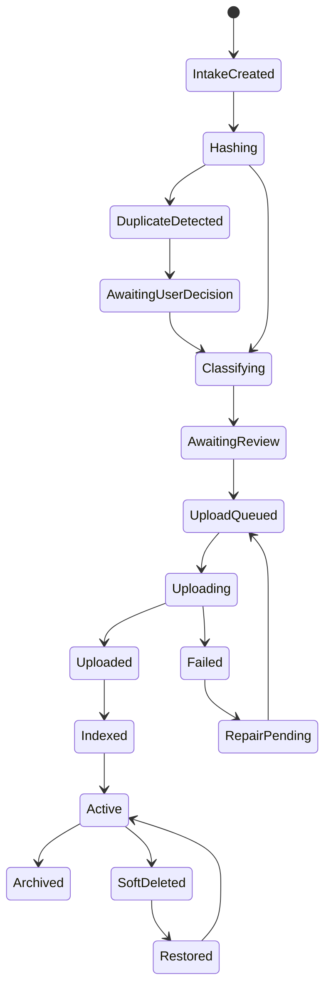

# Architecture - System Overview

## Purpose

Define the complete StoragePK system boundary and the relationships between clients, backend services, data stores, workers, AI services, and external storage providers.

## Scope

This document covers the logical architecture for web, desktop, API, queues, metadata database, search, AI, Google Drive, Telegram, observability, and admin operations.

## Responsibilities

- Establish the canonical architecture used by all other documentation.
- Define which subsystem owns each class of data and behavior.
- Separate StoragePK's metadata authority from provider-owned file bytes.

## Assumptions

- StoragePK owns metadata, taxonomy, permissions, audit events, sync state, extracted text, and search documents.
- Google Drive and Telegram store file bytes and provider-level object references.
- All clients communicate with the StoragePK backend for canonical state.
- Desktop may stage files locally but does not become the source of truth.

## Dependencies

- [../00-overview.md](../00-overview.md)
- [backend-architecture.md](backend-architecture.md)
- [../database/schema.md](../database/schema.md)
- [../api/resources.md](../api/resources.md)
- [../security/threats.md](../security/threats.md)

## Detailed Explanation

StoragePK uses a hub-and-adapter architecture. Clients submit intake sessions to the API. The API persists metadata and enqueues background work. Workers upload bytes to providers, extract text, generate thumbnails, classify files, update search, and reconcile provider state.

### Ownership Rules

| Data | Owner | Notes |
| --- | --- | --- |
| User identity | Auth service | External OAuth identities map to internal users. |
| Provider tokens | Provider account service | Encrypted at rest and never returned after creation. |
| File metadata | File service | Canonical name, checksum, folder, tags, status, and version. |
| File bytes | Storage providers | Referenced by `storage_objects.provider_object_id`. |
| Taxonomy | Folder and classification services | Provider folder structure may mirror but never replaces StoragePK taxonomy. |
| Search | Search service | Derived from DB, extracted text, and embeddings. |
| Audit | Audit service | Append-only business event history. |

### Provider Strategy

Google Drive is the default durable provider because it supports OAuth and resumable uploads. Telegram is an optional provider for lightweight archival or chat-channel storage. Provider-specific limitations are hidden behind a `StorageProvider` contract, but they must be visible in UX when they affect a user's action.

Google Drive resumable uploads should be used for large uploads because Google's official Drive API supports creating resumable upload sessions. Telegram Bot API limits depend on whether the public Bot API or a self-hosted local Bot API server is used; the implementation must record the configured limit and reject or reroute files before attempting upload.

### Core State Machine

## Edge Cases

- Provider upload succeeds but DB update fails: create reconciliation task and mark provider object as orphan candidate.
- DB update succeeds but provider upload fails: resource stays in failed state with no active storage object.
- Search index is stale: resource remains accessible through DB listing and shows `index_status=pending`.
- User disconnects provider: existing resources become degraded but not deleted.
- AI classification fails: file remains manually classifiable.
- Desktop goes offline mid-upload: local queue persists and retries using the same upload session when possible.

## Future Considerations

- Add S3-compatible storage provider.
- Add a provider migration service for moving objects between Drive, Telegram, S3, and local vaults.
- Add a formal event-sourcing stream if audit and repair workflows become complex.

