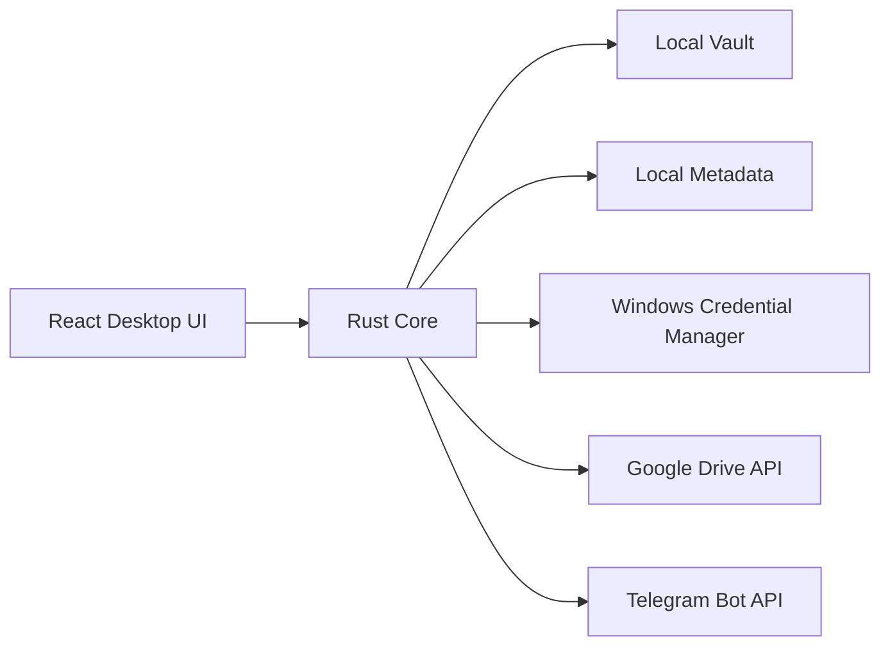

# System Overview

## Supported Product

StoragePK Desktop is a standalone Tauri application. The React interface calls a Rust core that owns local file operations, metadata persistence, provider credentials, and uploads. No StoragePK server is required for desktop use.

## Data Ownership

| Data | Owner |
| --- | --- |
| Original imported bytes | Local vault |
| Categories, hashes, provider state | Local metadata |
| Google and Telegram credentials | Windows Credential Manager |
| Uploaded file copies | Selected provider account or destination |

Every upload is prepared from an immutable local snapshot and verified against its expected size and SHA-256. Google Drive remote objects include StoragePK reconciliation metadata. Telegram preserves one local file as one supported document.

## Provider Isolation

Google accounts and Telegram destinations are separate storage targets. StoragePK records the exact destination for each upload and does not present combined accounts as one provider quota.

Google Drive uses the least-privilege `drive.file` scope. Telegram access is also controlled by membership of the destination chat, group, or channel; StoragePK cannot override Telegram membership.

## Hosted Foundation

The repository also contains a Next.js web app, NestJS API, BullMQ worker, PostgreSQL schema, and shared provider contracts. These packages build and test in CI but are not required by the desktop product and are not deployed by this repository.
