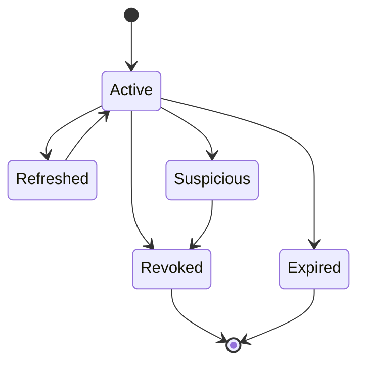

# Auth - Session Management

## Purpose

Define session lifecycle, refresh-token rotation, device management, revocation, and security monitoring.

## Scope

This document covers web sessions, desktop sessions, refresh tokens, session families, devices, logout, and suspicious activity.

## Responsibilities

- Keep long-lived access secure.
- Support desktop background upload without unsafe permanent tokens.
- Give users control over active devices.

## Assumptions

- Access tokens expire quickly.
- Refresh tokens rotate and are bound to session and device.
- Desktop stores tokens in OS credential storage.

## Dependencies

- [authentication.md](authentication.md)
- [authorization.md](authorization.md)
- [../api/authentication.md](../api/authentication.md)

## Detailed Explanation

Session states:

Rules:

- Store only hashed refresh-token identifiers server-side.
- Rotate refresh token on every refresh.
- Reuse of an old refresh token revokes the entire session family.
- Desktop device revocation stops background uploads after current safe checkpoint.
- Logout revokes the current session only unless user selects all devices.

Session metadata:

- User ID.
- Device ID.
- Client type.
- Created time.
- Last used time.
- IP hash and user-agent summary.
- Revoked time and reason.

## Edge Cases

- Desktop offline longer than refresh token expiry must require re-authentication.
- Browser cookie cleared without server logout leaves server session active until expiry; settings can revoke it.
- Token refresh race from multiple tabs should be handled with client coordination and server grace window.
- Revoked session cannot receive realtime events.

## Future Considerations

- Add trusted location/device policy.
- Add MFA step-up for sensitive actions.
- Add session risk scoring.

