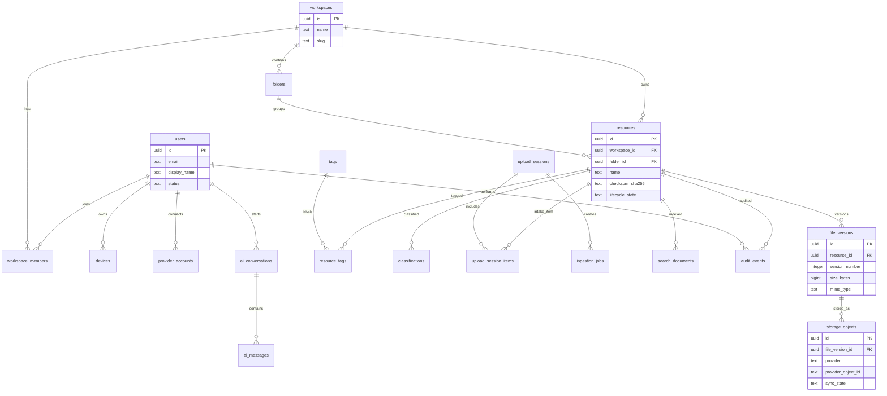

# Database - ER Diagram

## Purpose

Show the core StoragePK metadata model and entity relationships.

## Scope

This document covers user, workspace, provider, resource, classification, search, AI, and audit entities.

## Responsibilities

- Provide a visual overview of database relationships.
- Align schema and migration docs.
- Help engineers understand cascade and ownership paths.

## Assumptions

- PostgreSQL is the canonical database.
- File bytes live in providers, not in PostgreSQL.
- All primary entities use UUID identifiers.

## Dependencies

- [schema.md](schema.md)
- [indexes.md](indexes.md)
- [migrations.md](migrations.md)

## Detailed Explanation

## Edge Cases

- A resource can temporarily have no successful storage object while upload is failed.
- A file version can have multiple storage objects during migration or replication.
- A folder can be soft-deleted while resources are retained or moved according to policy.
- Audit events reference deleted users by preserving actor snapshots.

## Future Considerations

- Add vector table or external vector index references.
- Add teams, roles, and group permission entities.
- Add retention and legal hold entities.

