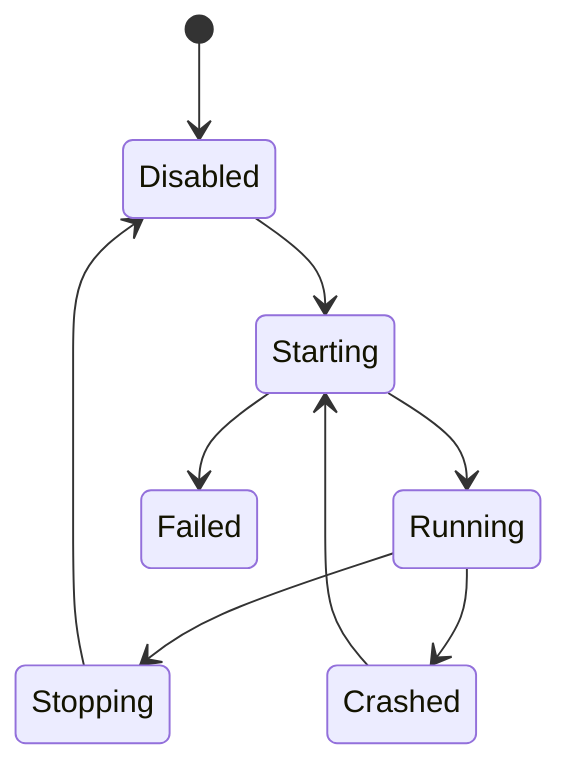

# Desktop - Provider Connector

## Purpose

Define the desktop-side connector that executes local provider jobs, especially Telegram local Bot API uploads from the user's own machine.

## Scope

This document covers desktop auth, device trust, capability registration, local staging paths, local server process ownership, job pull/claim, progress reporting, offline recovery, cancellation, and security rules.

## Responsibilities

- Let desktop perform jobs cloud workers cannot perform.
- Keep local files and localhost services under user-device control.
- Provide implementation-ready behavior for desktop provider uploads.

## Assumptions

- StoragePK desktop uses Tauri or equivalent native shell.
- Desktop can run foreground, tray, or background mode.
- Desktop sessions are device-bound and revocable.
- Local Telegram Bot API server binds to localhost by default.

## Dependencies

- [../providers/desktop-connector-protocol.md](../providers/desktop-connector-protocol.md)
- [../providers/telegram-local-bot-api-server.md](../providers/telegram-local-bot-api-server.md)
- [../providers/provider-state-machines.md](../providers/provider-state-machines.md)
- [../auth/session-management.md](../auth/session-management.md)

## Detailed Explanation

### Desktop Connector Responsibilities

| Area | Required Behavior |
| --- | --- |
| Auth | Use device-bound session and refresh rotation. |
| Capability | Report local provider availability and max upload size. |
| Job Pull | Claim only compatible jobs through authenticated lease API. |
| Local Files | Use app-managed staging and never expose arbitrary paths. |
| Local Server | Start, health-check, stop, and restart Telegram local Bot API server. |
| Progress | Emit bytes uploaded and provider stage events. |
| Recovery | Resume pending jobs after restart. |
| Security | Bind localhost, verify binary, redact tokens, protect temp files. |

### Local File Path Rules

- Desktop must normalize and canonicalize staged file paths.
- Staging root must be inside StoragePK app data directory unless user chooses an advanced folder.
- Desktop must not pass user arbitrary paths to local Bot API server without staging validation.
- Temporary files are deleted according to cleanup policy.

### Local Server Process Ownership



Process rules:

- Verify binary checksum or signed package before launch.
- Use generated port when possible.
- Bind to `127.0.0.1`.
- Store PID and port locally.
- Restart only with backoff.
- Surface crash reason in settings.

### Progress Event

```json
{
  "jobId": "uuid",
  "leaseId": "uuid",
  "deviceId": "uuid",
  "state": "uploading",
  "bytesUploaded": 73400320,
  "totalBytes": 104857600,
  "providerStage": "telegram_send_document",
  "occurredAt": "2026-07-27T10:00:00Z"
}
```

## Edge Cases

- User closes laptop during upload; lease expires or desktop resumes if local state confirms safe continuation.
- Desktop uploads to Telegram but cannot reach StoragePK API; local completion cache retries completion call.
- Two desktop devices are online; lease ensures only one executes each job.
- Local server crashes after accepting upload; connector verifies Telegram message before retry.
- User revokes device while job runs; desktop stops after safe checkpoint and token refresh fails.

## Future Considerations

- Add LAN connector mode.
- Add desktop service install option.
- Add local encrypted queue.

