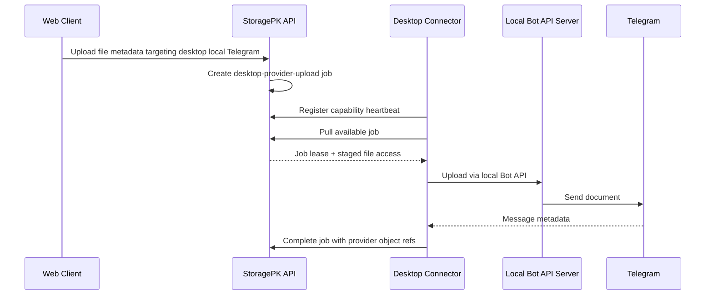
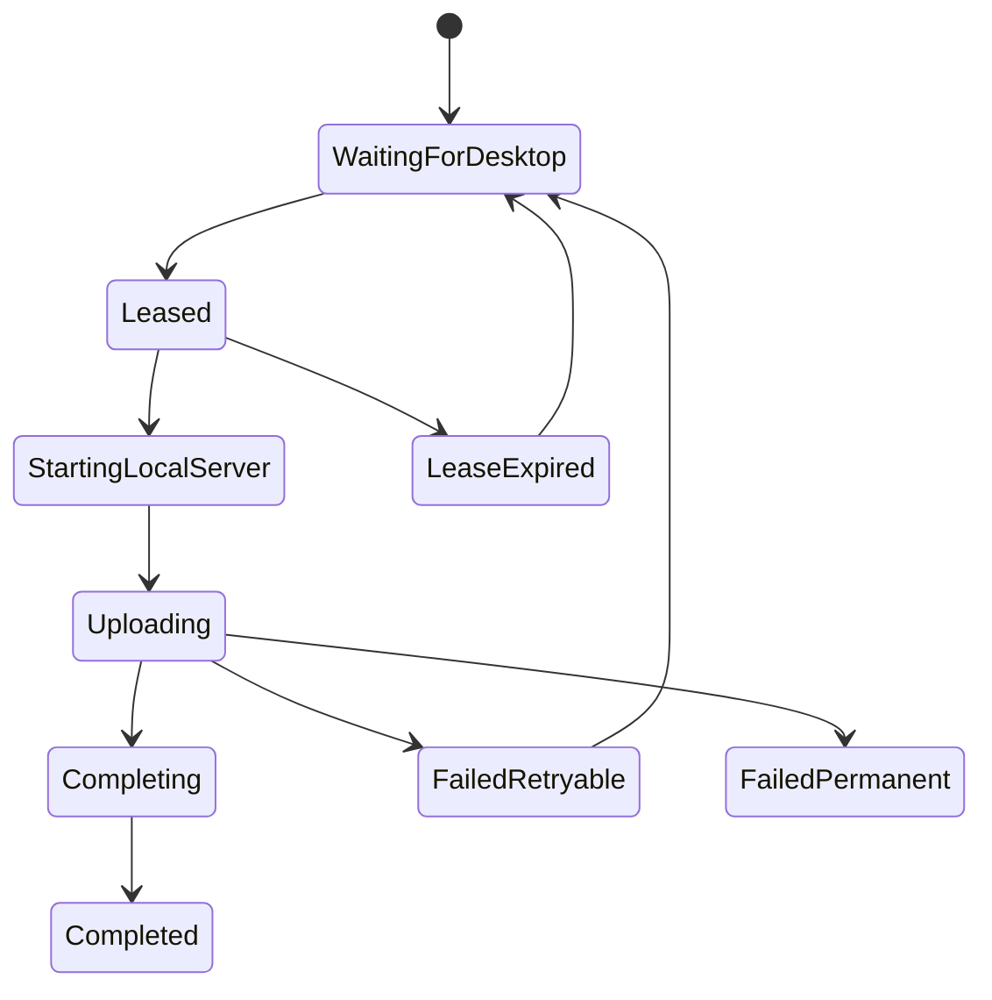

# Providers - Desktop Connector Protocol

## Purpose

Define how StoragePK desktop executes provider jobs that cloud/web workers cannot execute, especially Telegram desktop-managed local Bot API uploads.

## Scope

This document covers desktop registration, capability reporting, job polling, leases, upload execution, progress events, cancellation, retry, offline behavior, and security.

## Responsibilities

- Let the web app queue jobs that the desktop app can later execute.
- Keep local-only provider access out of cloud workers.
- Ensure desktop local Telegram uploads are idempotent and auditable.

## Assumptions

- Desktop app can run in foreground, tray, or background mode.
- Desktop local Bot API server binds to `127.0.0.1`.
- Cloud API cannot connect to the user's localhost.
- Desktop connector uses authenticated API calls with device-bound sessions.

## Dependencies

- [telegram-local-bot-api-server.md](telegram-local-bot-api-server.md)
- [routing-algorithm.md](routing-algorithm.md)
- [provider-state-machines.md](provider-state-machines.md)
- [provider-error-catalog.md](provider-error-catalog.md)
- [../api/websocket.md](../api/websocket.md)

## Detailed Explanation

### Protocol Overview



### Capability Registration

Desktop heartbeat:

```json
{
  "deviceId": "uuid",
  "workspaceId": "uuid",
  "capabilities": [
    {
      "type": "telegram_local_bot_api",
      "state": "running",
      "maxUploadBytes": 2097152000,
      "bindHost": "127.0.0.1",
      "port": 49152,
      "version": "telegram-bot-api-x.y.z"
    }
  ],
  "localQueue": {
    "active": 1,
    "pending": 3,
    "failed": 0
  }
}
```

Rules:

- Heartbeat interval: 15-60 seconds.
- Capability expires if no heartbeat after 2 minutes.
- Backend stores capability state but never tries to call localhost directly.

### Job Lease

Desktop pulls jobs:

```text
POST /v1/desktop/jobs/lease
```

Request:

```json
{
  "workspaceId": "uuid",
  "deviceId": "uuid",
  "capabilities": ["telegram_local_bot_api"],
  "maxJobs": 2
}
```

Response:

```json
{
  "jobs": [
    {
      "jobId": "uuid",
      "leaseId": "uuid",
      "leaseExpiresAt": "2026-07-27T10:05:00Z",
      "providerAccountId": "uuid",
      "fileVersionId": "uuid",
      "stagedFileRef": "desktop-local-or-signed-download-ref",
      "idempotencyKey": "workspace:item:version:attempt"
    }
  ]
}
```

Lease rules:

- Job can be leased by one device at a time.
- Lease expiry returns job to pending.
- Completion must include lease ID.
- Cancelled jobs stop after safe checkpoint.

### Execution States



## Edge Cases

- Desktop goes offline after lease; job returns to pending after lease timeout.
- Desktop uploaded to Telegram but completion call failed; repair verifies message metadata before retry.
- User closes desktop with background mode disabled; active jobs pause.
- Staged file exists only on web/cloud, not desktop; desktop must download staged file first.
- Staged file exists only on desktop local disk; cloud cannot run job.
- Two desktops are signed in; backend leases each job to only one compatible device.

## Future Considerations

- Add encrypted peer-to-peer local transfer for LAN devices.
- Add desktop job push through realtime channel after heartbeat.
- Add desktop connector diagnostics UI.

