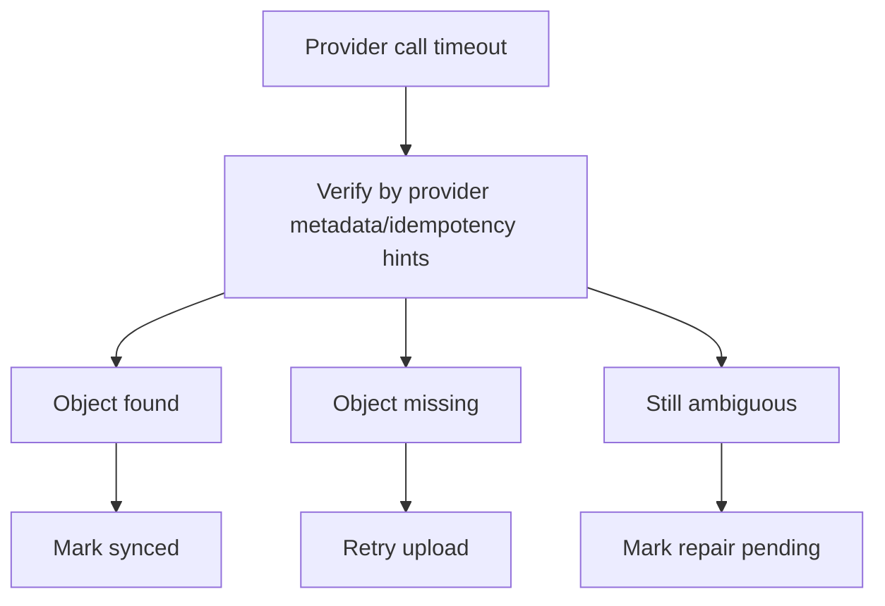

# Providers - Idempotency and Reconciliation

## Purpose

Define exact idempotency and reconciliation rules for provider uploads, retries, timeouts, replication, and orphan detection.

## Scope

This document covers idempotency keys, database constraints, upload attempt records, Drive resumable sessions, Telegram message verification, replica retries, and repair jobs.

## Responsibilities

- Prevent duplicate provider objects during retry.
- Recover from ambiguous provider failures.
- Make repair workflows deterministic and auditable.

## Assumptions

- Provider calls can timeout after success.
- Workers can execute the same job more than once.
- StoragePK must not trust client-reported completion.
- Provider metadata should include StoragePK IDs where provider supports it.

## Dependencies

- [routing-algorithm.md](routing-algorithm.md)
- [provider-state-machines.md](provider-state-machines.md)
- [provider-error-catalog.md](provider-error-catalog.md)
- [drive-adapter-spec.md](drive-adapter-spec.md)
- [telegram-adapter-spec.md](telegram-adapter-spec.md)

## Detailed Explanation

### Idempotency Keys

| Operation | Key Format |
| --- | --- |
| Upload session item commit | `workspace:{workspaceId}:upload-item:{itemId}:commit` |
| Route decision | `workspace:{workspaceId}:item:{itemId}:version:{versionId}:route:{attempt}` |
| Provider upload attempt | `workspace:{workspaceId}:version:{versionId}:provider:{providerAccountId}:attempt:{attempt}` |
| Replica upload attempt | `workspace:{workspaceId}:version:{versionId}:replica:{providerAccountId}:attempt:{attempt}` |
| Desktop job lease | `desktop:{deviceId}:job:{jobId}:lease:{leaseId}` |

### Upload Attempt Record

Every provider call creates an upload attempt record:

```json
{
  "attemptId": "uuid",
  "fileVersionId": "uuid",
  "providerAccountId": "uuid",
  "routeDecisionId": "uuid",
  "idempotencyKey": "workspace:...",
  "provider": "drive",
  "state": "uploading",
  "startedAt": "2026-07-27T10:00:00Z",
  "completedAt": null,
  "providerRequestId": "provider-specific",
  "providerObjectId": null,
  "errorCode": null
}
```

Database constraints:

- Unique active upload attempt per `(file_version_id, provider_account_id, attempt_number)`.
- Unique synced storage object per `(file_version_id, provider_account_id, provider_object_id)`.
- Unique primary storage object per file version unless migration policy allows multiple primaries.

### Timeout Reconciliation



Drive reconciliation:

- Check stored resumable upload session if available.
- Search by app properties or generated name marker when safe.
- Verify object size and checksum where available.
- Save provider object if matching object exists.

Telegram reconciliation:

- Check message ID if response was saved locally before completion failed.
- If no message ID exists, do not blindly resend without user/worker policy.
- If a duplicate message is detected by StoragePK metadata caption or local attempt cache, attach the existing message.
- If ambiguous, mark repair pending.

### Replication Semantics

- Primary upload success makes the file active.
- Replica failure sets `replica_pending` or `backup_degraded`, not primary failure.
- Replica retries must use separate idempotency keys per replica provider account.
- Deleting a primary does not delete replicas unless policy explicitly says so.

## Edge Cases

- Provider creates object but metadata write fails; reconciliation finds orphan candidate.
- Worker crashes after Telegram returns message metadata but before API completion; desktop stores local attempt cache and reports on restart.
- Drive resumable upload session expires; create new attempt only after verifying no completed object.
- Replica uploads can succeed after primary is deleted; repair marks replica orphan candidate.
- Same file intentionally stored twice in different folders; resource IDs differ even when checksum matches.

## Future Considerations

- Add outbox pattern for provider object completion events.
- Add provider metadata scanner for orphan recovery.
- Add user-visible duplicate provider object cleanup.

