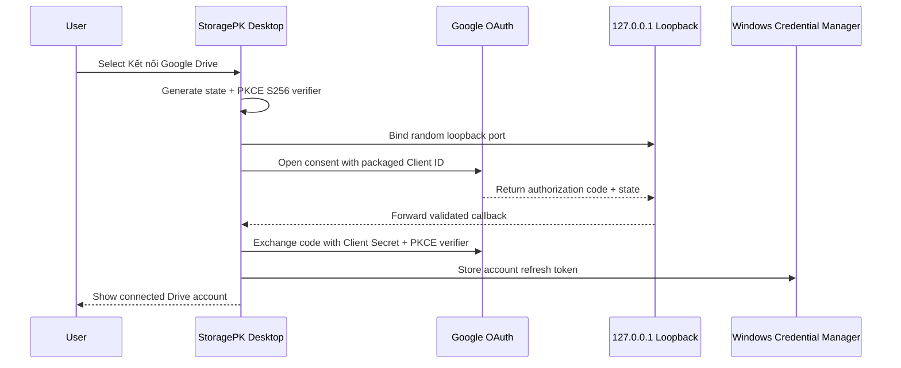
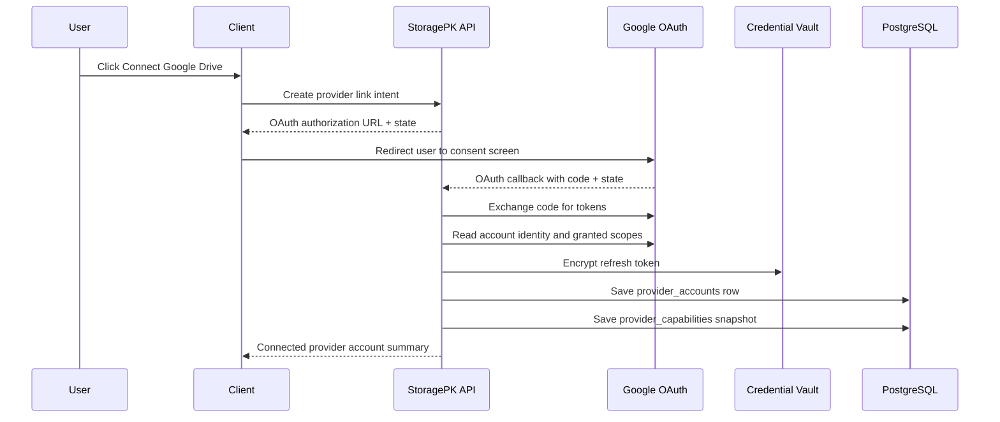
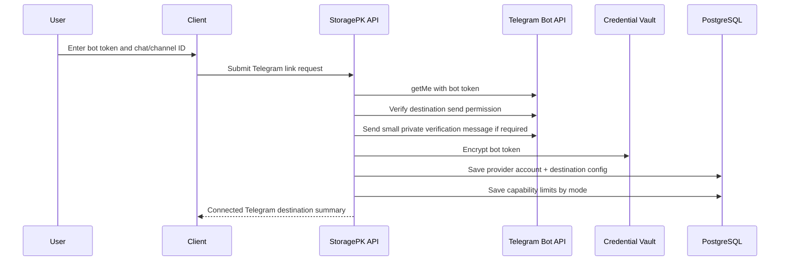

# Providers - Linking Flows

## Purpose

Define exactly how StoragePK links Google Drive accounts and Telegram destinations before they can be used in storage pools.

## Scope

This document covers Google OAuth, Telegram bot/channel setup, multi-account identity checks, token storage, reconnect, revoke, health verification, and UX states.

## Responsibilities

- Prevent ambiguous or unsafe provider linking.
- Ensure multiple Drive accounts and Telegram destinations can coexist.
- Make provider capability and legal/policy constraints visible before upload.

## Assumptions

- StoragePK Desktop `0.3.0` implements native one-click Drive linking; the hosted platform flow remains a separate architecture path.
- A workspace can connect many Google Drive accounts and many Telegram destinations.
- The hosted backend owns hosted provider credentials. The standalone desktop stores refresh tokens in Windows Credential Manager and does not expose them to React.
- StoragePK should start with narrow Google Drive scope where possible and only request broader scopes when a feature truly needs them.

## Dependencies

- [storage-pools.md](storage-pools.md)
- [provider-contract.md](provider-contract.md)
- [google-drive.md](google-drive.md)
- [telegram.md](telegram.md)
- [policy-and-feasibility.md](policy-and-feasibility.md)
- [../database/schema.md](../database/schema.md)

## Detailed Explanation

### Google Drive Linking

Recommended MVP approach: use OAuth with `https://www.googleapis.com/auth/drive.file` for creating and managing files StoragePK creates or files the user explicitly shares with StoragePK. This scope is narrower and safer than full Drive access. If StoragePK later needs to read or manage all existing user Drive files, broader restricted scopes must go through Google verification and possibly security assessment.

#### Desktop One-Click Flow (`0.3.0`)

The production installer packages `STORAGEPK_GOOGLE_CLIENT_ID` and its matching `STORAGEPK_GOOGLE_CLIENT_SECRET` at build time. The end user does not create a Google Cloud project or enter either value.

Manual custom Client ID and Client Secret entry is only a developer fallback. Live token and refresh requests require the matching secret. Because an installed-app secret is embedded in the binary, it is not absolutely confidential, but its actual value must not be committed or logged. PKCE `S256` remains mandatory.

The publisher's consent project must not remain in **Testing** for broad distribution because Testing-mode refresh tokens expire after seven days. Before broad release, the publisher must select **Publish app**, reach **In production**, and complete the applicable basic verification for the non-sensitive `drive.file` scope. This document does not assert that those external gates are already complete.

#### Hosted Platform Flow

Google Drive link validation:

| Check | Rule | Failure |
| --- | --- | --- |
| OAuth state | Must match pending link intent. | `OAUTH_STATE_INVALID` |
| Desktop PKCE/loopback | Must use `S256`, the exact random loopback listener, callback path, and state. | `OAUTH_STATE_INVALID` |
| Granted scopes | Must include required MVP scopes. | `PROVIDER_SCOPE_MISSING` |
| Account identity | Must capture Google subject/email. | `PROVIDER_IDENTITY_UNAVAILABLE` |
| Duplicate account | Same Google subject can be reused only if user confirms. | `PROVIDER_ACCOUNT_DUPLICATE` |
| Token encryption | Must succeed before DB commit. | `CREDENTIAL_ENCRYPTION_FAILED` |
| Health check | Must create/read minimal app-managed metadata or verify Drive access. | `PROVIDER_HEALTH_FAILED` |

### Telegram Linking

Telegram is not OAuth in the same way. MVP linking uses a bot token plus destination chat/channel ID. StoragePK must verify the bot can send documents to the destination and must record whether the connection uses public Bot API mode or local Bot API server mode.

Telegram link validation:

| Check | Rule | Failure |
| --- | --- | --- |
| Bot token | Must pass `getMe`. | `TELEGRAM_TOKEN_INVALID` |
| Destination | Chat/channel ID must be valid and reachable by bot. | `TELEGRAM_DESTINATION_INVALID` |
| Send permission | Bot must be allowed to send documents. | `TELEGRAM_SEND_PERMISSION_DENIED` |
| Mode | Public or local Bot API mode must be explicit. | `TELEGRAM_MODE_UNKNOWN` |
| File limit | Capability snapshot must store max upload/download behavior. | `TELEGRAM_LIMIT_UNKNOWN` |
| Privacy warning | User must acknowledge destination membership risk. | `TELEGRAM_PRIVACY_ACK_REQUIRED` |

Desktop-managed local mode:

- The desktop app can start the local Bot API server on the user's computer.
- The backend stores provider configuration and route policy, but desktop performs uploads that require the user's `localhost` server.
- Web uploads that target desktop local Telegram must create pending jobs for the desktop connector.
- If desktop is offline, those jobs remain queued or reroute according to storage pool policy.

### Reconnect and Revoke

Reconnect rules:

- Reconnect must verify provider identity matches the original provider account unless user explicitly creates a new account.
- Queued jobs resume only after health and capability checks pass.
- Reconnect updates encrypted credentials and capability snapshot.

Revoke rules:

- Revoking provider stops new uploads to that account.
- Existing StoragePK metadata remains.
- Provider deletion is separate and requires explicit confirmation.
- Storage pools must be recalculated when an account is revoked.

## Edge Cases

- User connects 10 Google accounts with similar email names; UI must show account email, provider account label, quota, and last health check.
- User reconnects `drive-main@gmail.com` but signs into `drive-other@gmail.com`; StoragePK must block unless user chooses "connect as new account".
- Google grants fewer scopes than requested; StoragePK must disable unsupported features rather than assuming access.
- A developer test project reconnects successfully but loses refresh access after seven days; this is expected while the consent project remains in **Testing**.
- Telegram bot is valid but not admin in a channel; linking can succeed only if send-document permission is verified.
- Telegram public Bot API is selected but user expects 2GB uploads; UI must show hard limit and suggest local Bot API or Drive.
- Local Telegram Bot API server is configured but unreachable from worker network; provider health is degraded.
- Desktop-managed local Bot API is enabled but the desktop app is closed; large Telegram jobs remain pending or reroute.

## Future Considerations

- Add Google Picker for user-selected existing Drive files under `drive.file`.
- Add shared-drive support with explicit Drive capability checks.
- Add Telegram local Bot API deployment wizard.
- Add provider link test suite that runs against disposable test accounts.
