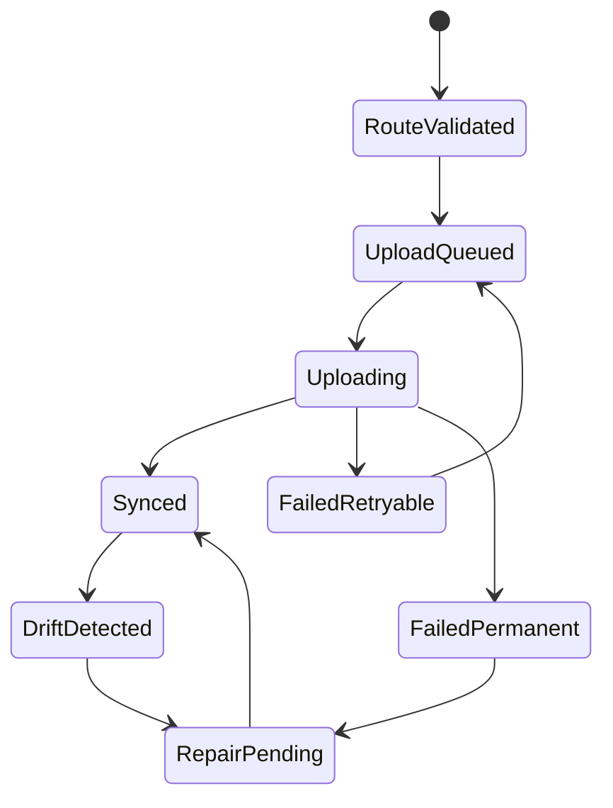

# Providers - Storage Provider Contract

## Purpose

Define the provider abstraction used to store file bytes in Google Drive, Telegram, and future storage backends.

## Scope

This document covers provider capabilities, method contracts, state mapping, validation, idempotency, health checks, quota handling, and failure behavior.

## Responsibilities

- Keep provider-specific behavior out of controllers and resource services.
- Make Drive and Telegram interchangeable at the routing layer where possible.
- Preserve StoragePK as the canonical metadata and taxonomy owner.

## Assumptions

- Providers store bytes and return external object references.
- StoragePK owns resource metadata, folder taxonomy, permissions, audit, and search.
- Providers have different limits and cannot be treated as identical storage systems.

## Dependencies

- [storage-pools.md](storage-pools.md)
- [google-drive.md](google-drive.md)
- [telegram.md](telegram.md)
- [../architecture/system-overview.md](../architecture/system-overview.md)
- [../backend/services.md](../backend/services.md)

## Detailed Explanation

StoragePK supports more than one account per provider. A workspace can connect many Google Drive accounts and many Telegram destinations, then group them into storage pools for quota-aware routing. The provider contract is the low-level adapter; [storage-pools.md](storage-pools.md) defines how multiple adapters are stacked into one logical storage layer.

Provider capability model:

| Capability | Meaning |
| --- | --- |
| `upload` | Can create a provider object from staged bytes. |
| `download` | Can retrieve object bytes or a temporary URL. |
| `delete` | Can remove provider object if policy allows. |
| `verify` | Can check existence, size, checksum if available, and metadata. |
| `quotaStatus` | Can report capacity or rate limits. |
| `healthCheck` | Can validate token, connection, and minimum permissions. |
| `resumableUpload` | Can resume large uploads after interruption. |
| `folderMirror` | Can optionally mirror StoragePK folder paths. |
| `multiAccount` | Can participate in a storage pool with other accounts. |

Required provider operations:

| Operation | Input | Output | Notes |
| --- | --- | --- | --- |
| `validateRoute` | file metadata, provider account, workspace policy | route decision | Must run before enqueue. |
| `uploadObject` | staged object, metadata, idempotency key | provider object reference | Must be retry-safe. |
| `getObjectMetadata` | provider object reference | size, type, existence, modified time | Used by repair. |
| `downloadObject` | provider object reference | stream or signed URL | Permission checked before call. |
| `deleteObject` | provider object reference | deletion result | Requires explicit destructive permission. |
| `healthCheck` | provider account | health state | No raw secret in response. |
| `quotaStatus` | provider account | quota and limit summary | Cached with TTL. |

Provider state mapping:

## Edge Cases

- A pool can contain multiple accounts of the same provider; provider object IDs are unique only inside their provider account scope.
- Provider API timeout after successful upload must be resolved by verifying existing object before retry.
- Provider quota can change between route validation and worker execution.
- Provider object can be deleted outside StoragePK.
- Provider account can be revoked while jobs are queued.
- Provider-specific folder paths can be renamed externally; StoragePK folder remains canonical.

## Future Considerations

- Add S3-compatible provider.
- Add local encrypted provider.
- Add replication policies across providers.
- Add provider SDK test harness.
