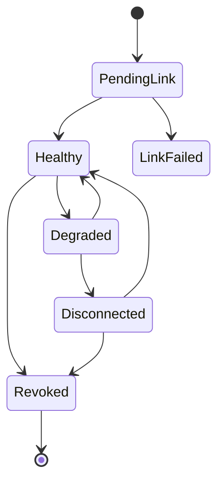
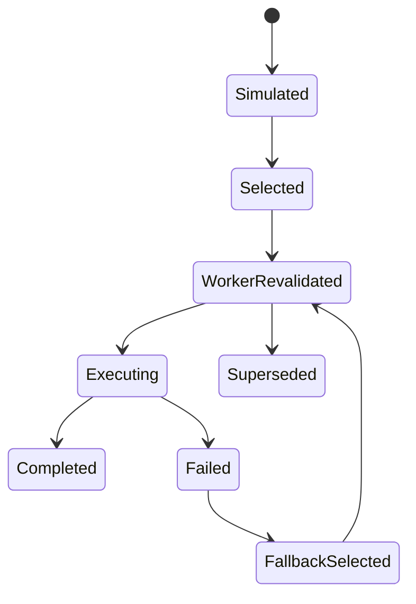

# Providers - State Machines

## Purpose

Define provider, storage pool, route decision, upload job, and desktop local server states.

## Scope

This document covers lifecycle states and allowed transitions for provider accounts, capabilities, pools, route decisions, storage objects, and desktop connector jobs.

## Responsibilities

- Prevent ambiguous provider state.
- Support safe retries, repair, and UI messaging.
- Give tests exact transition rules.

## Assumptions

- State transitions are enforced in services.
- Workers re-read current state before acting.
- Audit events are emitted for important transitions.

## Dependencies

- [routing-algorithm.md](routing-algorithm.md)
- [desktop-connector-protocol.md](desktop-connector-protocol.md)
- [provider-error-catalog.md](provider-error-catalog.md)
- [../database/schema.md](../database/schema.md)

## Detailed Explanation

### Provider Account State

| State | Meaning |
| --- | --- |
| `pending_link` | Link intent or credential validation is in progress. |
| `healthy` | Provider can perform required operations. |
| `degraded` | Provider can perform limited operations or has warnings. |
| `disconnected` | Token/permission/network prevents use. |
| `revoked` | User removed provider from StoragePK. |
| `link_failed` | Initial link attempt failed. |

### Route Decision State

### Storage Object State

| State | Meaning |
| --- | --- |
| `queued` | Provider upload is scheduled. |
| `uploading` | Provider adapter is writing bytes. |
| `synced` | Provider object exists and metadata is saved. |
| `replica_pending` | Primary exists but replica is not complete. |
| `failed_retryable` | Retry can continue. |
| `failed_permanent` | User or admin action required. |
| `drift_detected` | Provider object differs or is missing externally. |
| `orphan_candidate` | Provider object may exist without DB state. |
| `deleted_external` | Provider object was deleted or intentionally removed. |

### Desktop Local Server State

| State | Meaning |
| --- | --- |
| `disabled` | User has not enabled local mode. |
| `starting` | Desktop is launching server process. |
| `running` | Server is healthy on localhost. |
| `port_conflict` | Desired port unavailable. |
| `unreachable` | Process not responding. |
| `telegram_unreachable` | Server running but cannot reach Telegram. |
| `stopped` | Server stopped intentionally. |
| `crashed` | Server stopped unexpectedly. |

## Edge Cases

- A provider account can be `healthy` for public Telegram but not eligible for large local-mode jobs.
- Route decision can be `selected` but later `superseded` by worker fallback.
- Storage object can be `synced` while replica object is `failed_retryable`.
- Desktop server can be `running` but upload job still fails because destination permission changed.

## Future Considerations

- Add formal state transition table generated into tests.
- Add state diagrams to admin diagnostics UI.
- Add user-facing state localization.

