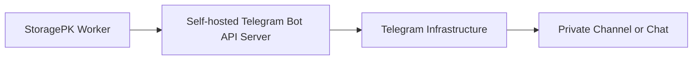
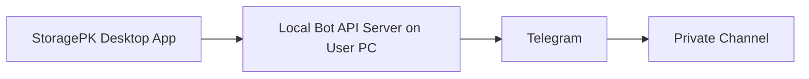
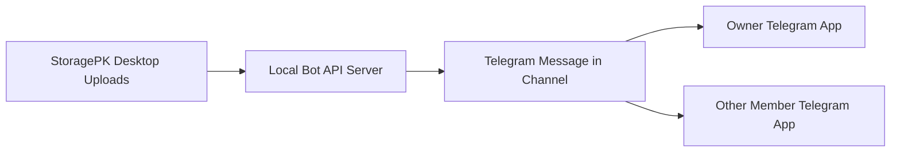
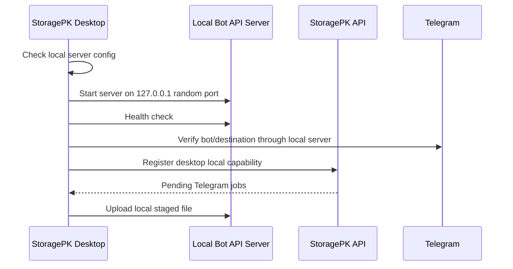

# Providers - Telegram Local Bot API Server

## Purpose

Explain what a Telegram Local Bot API Server is and how StoragePK should use it for larger Telegram-backed uploads.

## Scope

This document covers the difference between public Telegram Bot API and local Bot API server mode, architecture, requirements, limits, deployment assumptions, security, and when StoragePK should enable it.

## Responsibilities

- Prevent confusion between Telegram itself, a Telegram bot, and the local Bot API server.
- Define when Telegram can support larger files in StoragePK.
- Document operational and security risks before implementation.

## Assumptions

- MVP uses Telegram bots, not a full Telegram user-account MTProto client.
- Public Bot API mode is the default and safest to operate.
- Local Bot API server mode is an advanced self-hosted option.
- The local Bot API server is a bridge to Telegram, not a replacement for Telegram servers.

## Dependencies

- [telegram.md](telegram.md)
- [capacity-planning.md](capacity-planning.md)
- [policy-and-feasibility.md](policy-and-feasibility.md)
- [telegram-local-hardening.md](telegram-local-hardening.md)
- [risk-register.md](risk-register.md)
- [../deployment/docker.md](../deployment/docker.md)

## Detailed Explanation

Normally, a bot calls Telegram like this:

```text
StoragePK Worker -> https://api.telegram.org/bot<TOKEN>/sendDocument -> Telegram
```

With a local Bot API server, StoragePK calls a server you run:

```text
StoragePK Worker -> http://local-bot-api:8081/bot<TOKEN>/sendDocument -> Telegram
```

The local server is the official `telegram-bot-api` server implementation. It accepts the same Bot API-style requests, but because it runs near your application and can access local files directly, it unlocks higher limits documented by Telegram local mode, including uploads up to 2000 MB and downloads without the public `getFile` size limit.



### Can It Run On The User's Own Computer?

Yes. For StoragePK desktop, the preferred advanced mode is `desktop_managed_local_bot_api`. The desktop app can start and stop a local Telegram Bot API server on the user's machine, then point Telegram uploads to `http://127.0.0.1:<port>`.



This works well when the desktop app owns the upload worker. The web app or cloud API cannot directly call `localhost` on the user's machine. If a file is uploaded from web and must use the user's local Telegram server, StoragePK needs a desktop connector pattern: cloud records the pending job, desktop app pulls the job, then desktop uploads through its own local server.

### Who Can Download After Upload?

After StoragePK uploads a file to Telegram, the file exists as a Telegram message/document in the configured destination chat, group, or channel. The local Bot API server is not required for a normal Telegram user to open that destination and download the file in the Telegram app.



Download rules:

| Access Path | Can Download? | Notes |
| --- | --- | --- |
| Same Telegram account that can see the destination | Yes | The user can download from Telegram app if the message still exists. |
| Another Telegram account added to the private channel/group | Yes | Telegram membership grants access outside StoragePK permissions. |
| StoragePK web without desktop/local server | Only if provider route supports it | Large Telegram files may require desktop connector or local Bot API server for bot-side retrieval. |
| Telegram bot public `getFile` | Limited | Public Bot API download has the documented 20 MB limit. |
| Telegram bot through local Bot API server | Larger retrieval supported | Requires local/server Bot API to be online. |

StoragePK must treat Telegram destination membership as a separate access-control system. If another person can access the Telegram channel/chat, they can access uploaded files even if StoragePK would not grant that person app-level permission.

### Operating Modes

| Mode | Runs Where | Best For | Limitation |
| --- | --- | --- | --- |
| `public_bot_api` | Telegram public API | Simple small-file archive. | 50 MB upload for documents and 20 MB public `getFile` download limit. |
| `desktop_managed_local_bot_api` | User's own PC, started by StoragePK desktop. | Personal desktop uploads up to local-mode limits. | PC must be on and app/background service running. |
| `docker_local_bot_api` | User PC, NAS, home server, or VPS through Docker. | Advanced users and stable always-on setups. | Needs Docker and volume/network config. |
| `server_managed_local_bot_api` | StoragePK-controlled server/VPS. | Production backend workers. | Higher ops/security responsibility and secret handling. |

### Desktop Startup Flow



Desktop rules:

- Start the local server only when user enables advanced Telegram large-file mode.
- Bind to `127.0.0.1` by default, not public `0.0.0.0`.
- Use a random or configured local port and detect conflicts.
- Keep the process alive from tray/background mode while uploads are active.
- Stop the process when app exits if no background uploads are enabled.
- Persist local server health state for upload routing.
- If using Docker, mount only the staging folder needed for uploads.

### What It Is

| Item | Meaning |
| --- | --- |
| Bot token | Token from BotFather used by your bot. |
| Local Bot API server | Self-hosted server that implements Telegram Bot API endpoints. |
| Telegram servers | The real Telegram infrastructure where messages/files ultimately live. |
| API ID/API hash | Telegram app credentials required to run the local Bot API server. |
| Destination | Private chat, group, or channel where the bot sends files. |
| Desktop connector | StoragePK desktop process that can pull pending jobs and upload through local server. |

### What It Is Not

| Misunderstanding | Correct Explanation |
| --- | --- |
| "It hosts Telegram storage on my server." | No. It is an API bridge; Telegram still stores sent messages/files. |
| "It gives unlimited file size." | No. Local mode has documented limits such as 2000 MB upload. |
| "It removes Telegram privacy risks." | No. Channel/chat members can still access files. |
| "It replaces bot token security." | No. Bot tokens still need encryption and firewall protection. |
| "It is required for all Telegram use." | No. Small-file archive can use public Bot API. |

### StoragePK Decision Rule

| File Size / Use Case | Recommended Telegram Mode |
| --- | --- |
| Up to 50 MB document | Public Bot API is acceptable. |
| 50 MB to 2000 MB | Local Bot API server required if Telegram is selected. |
| Above 2000 MB | Use Drive or another provider in MVP. |
| Sensitive/private files | Prefer Drive or encrypted provider unless Telegram destination trust is explicit. |
| Critical backup | Use Drive replication first; Telegram can be secondary archive only with clear warning. |

### Deployment Requirements

StoragePK should require these configuration values for local mode:

| Setting | Purpose |
| --- | --- |
| `TELEGRAM_LOCAL_API_BASE_URL` | Internal URL of local Bot API server. |
| `TELEGRAM_API_ID` | Telegram application API ID. |
| `TELEGRAM_API_HASH` | Telegram application API hash. |
| Bot token | Encrypted per Telegram provider account. |
| Data directory | Local server working directory for file transfers. |
| Network policy | Restrict access to StoragePK worker network only. |

For desktop-managed mode, the base URL should normally be generated as:

```text
http://127.0.0.1:<allocated-port>
```

The desktop app stores process metadata locally and reports only capability/health to the backend.

### Security Rules

- Do not expose the local Bot API server publicly without strict network controls.
- Desktop-managed mode must bind to localhost by default.
- Do not add other Telegram accounts to the storage channel unless the user intends those accounts to access files.
- Do not enable Telegram `protect_content` when the intended workflow requires normal members to save/download files.
- Store API hash and bot tokens in secret manager or encrypted vault.
- Never log bot tokens or full request URLs containing tokens.
- Prefer private network access from worker to local server.
- Apply upload size limits before sending files to local server.
- Keep local server patched and monitored.

## Edge Cases

- Local server is running but cannot reach Telegram; provider health is degraded.
- Worker can reach local server, but local server cannot read the staged file path; upload fails with repairable state.
- Web upload requests cannot use a local server on the user's PC unless desktop connector pulls and performs the job.
- User closes laptop mid-upload; job pauses and resumes when desktop returns online.
- Another person is added to the Telegram destination after files are uploaded; that person can see and download existing visible messages according to Telegram behavior.
- StoragePK permission revocation does not remove access for someone who still has Telegram channel membership.
- User configures local mode but points to public `api.telegram.org`; StoragePK must detect mode mismatch.
- Local server disk fills with temporary transfer files; monitoring and cleanup are required.
- Bot has token and local server works, but bot lacks channel send permission; linking must fail.
- User expects 4 GB Premium-style upload; MVP local Bot API rule stays at 2000 MB unless validated by current provider behavior and policy.

## Future Considerations

- Add Docker Compose profile for local Bot API server.
- Add automated local server health probe.
- Add setup wizard that validates API ID, API hash, bot token, destination, upload, and download.
- Add optional advanced provider using MTProto only after security review.

## References

- Telegram Bot API: https://core.telegram.org/bots/api
- Telegram Bot API server source: https://github.com/tdlib/telegram-bot-api
