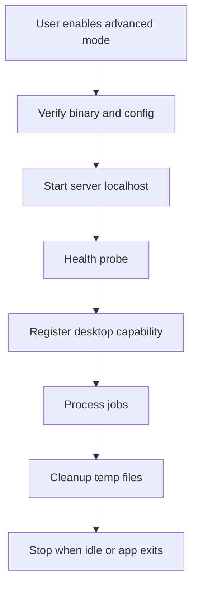

# Providers - Telegram Local Bot API Hardening

## Purpose

Define hardening controls for Telegram local Bot API server in desktop-managed, Docker, and server-managed modes.

## Scope

This document covers network binding, local authentication, binary provenance, firewall rules, Docker volume limits, temporary storage cleanup, logging, SSRF/CSRF posture, process lifecycle, and device trust.

## Responsibilities

- Keep local Telegram large-file mode safe by default.
- Prevent accidental public exposure of bot API endpoints.
- Provide security requirements for implementation and release review.

## Assumptions

- Desktop-managed mode is the preferred personal large-file mode.
- Local Bot API server is an advanced component and must be feature-flagged.
- Bot tokens and API hash values are sensitive.

## Dependencies

- [telegram-local-bot-api-server.md](telegram-local-bot-api-server.md)
- [desktop-connector-protocol.md](desktop-connector-protocol.md)
- [provider-threat-controls.md](provider-threat-controls.md)
- [../security/credential-lifecycle.md](../security/credential-lifecycle.md)

## Detailed Explanation

### Required Controls

| Control | Requirement |
| --- | --- |
| Bind address | Default to `127.0.0.1`; public bind is blocked in MVP. |
| Port | Auto-select high port; detect conflicts; do not reuse unsafe stale port. |
| Local auth | Only StoragePK desktop process should call local server; do not expose to browser pages. |
| Firewall | Add no inbound public firewall rule by default. |
| Binary provenance | Use bundled or downloaded binary with checksum/signature verification. |
| Process args | Do not pass secrets in command-line args if avoidable. |
| Logs | Redact bot tokens and request URLs. |
| Temp files | Store under app-managed staging; cleanup completed/failed transfers. |
| Docker volume | Mount only StoragePK staging folder, never whole user home or drive root. |
| Device trust | Desktop connector requires device-bound auth and revocable session. |

### SSRF/CSRF Posture

- Web pages must never be allowed to command the local Bot API server directly.
- Desktop UI commands must go through trusted native command boundary.
- Local server URL is not exposed to untrusted renderer content as a general fetch target.
- If desktop webview can access localhost, Content Security Policy must restrict arbitrary network calls.

### Process Lifecycle

## Edge Cases

- Antivirus blocks bundled server binary; show clear setup error and safe fallback to public Bot API/Drive.
- Port is taken by another process; auto-select another port and update local capability.
- User turns on VPN/firewall that blocks Telegram; health becomes degraded.
- Desktop crash leaves temp files; cleanup runs on next startup.
- A malicious local process attempts to call local API; localhost-only is not full auth, so do not store untrusted local URL as capability for cloud use.

## Future Considerations

- Add loopback token or mTLS between desktop and local server wrapper if needed.
- Add signed auto-update for local server binary.
- Add sandboxed helper process.

