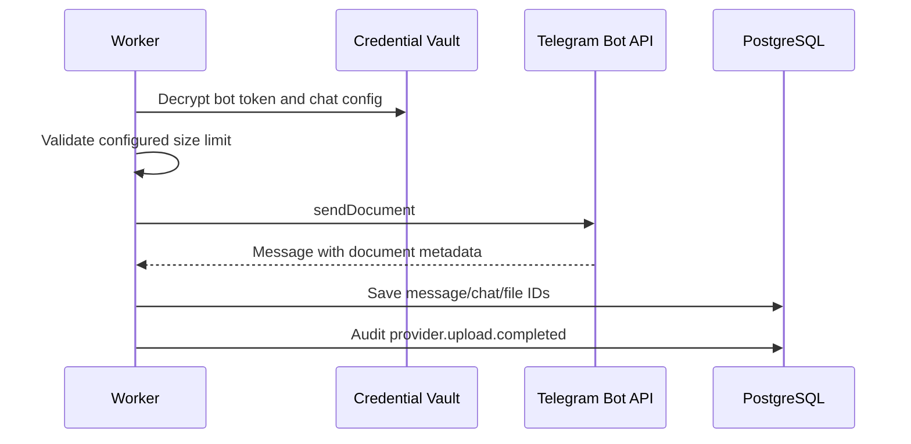

# Providers - Telegram

## Purpose

Define how StoragePK integrates with Telegram as a secondary storage provider.

## Scope

This document covers Telegram bot/channel configuration, public Bot API limits, local Bot API server mode, object mapping, retrieval constraints, security, and failure behavior.

## Responsibilities

- Use Telegram as an optional provider for compatible file storage and archive workflows.
- Make Telegram limits visible before upload.
- Keep StoragePK taxonomy, permissions, and metadata outside Telegram.

## Assumptions

- MVP uses a Telegram bot connected to a configured private chat, group, or channel.
- Telegram messages represent provider objects.
- Public Bot API and local Bot API server have different limits and deployment complexity.
- Telegram should not be the default universal provider for large files unless the configured mode supports them.

## Dependencies

- [provider-contract.md](provider-contract.md)
- [linking-flows.md](linking-flows.md)
- [telegram-local-bot-api-server.md](telegram-local-bot-api-server.md)
- [policy-and-feasibility.md](policy-and-feasibility.md)
- [../security/secrets.md](../security/secrets.md)
- [../api/resources.md](../api/resources.md)
- [../deployment/docker.md](../deployment/docker.md)

## Detailed Explanation

Telegram Bot API supports sending documents through `sendDocument`. Official docs state public bot uploads for `sendDocument` are currently limited to 50 MB, while `getFile` downloads through the public Bot API are limited to 20 MB. The official Bot API also documents local Bot API server mode, which can upload files up to 2000 MB and download without the same public download limit. StoragePK must record which mode is configured and validate files before queueing Telegram upload. Local mode is explained in [telegram-local-bot-api-server.md](telegram-local-bot-api-server.md).

StoragePK can connect multiple Telegram destinations, such as separate private channels for documents, media, archives, and critical backups. Telegram destinations can participate in storage pools, but the UI must clearly show their configured limits and privacy risks. Linking and feasibility rules are defined in [linking-flows.md](linking-flows.md) and [policy-and-feasibility.md](policy-and-feasibility.md).

Once uploaded, Telegram files are accessible to Telegram accounts that can access the destination chat/group/channel. StoragePK does not control Telegram membership. App-level permissions and Telegram destination permissions must be shown as separate layers.

Telegram storage object mapping:

| StoragePK Field | Telegram Meaning |
| --- | --- |
| `provider` | `telegram` |
| `provider_account_id` | Encrypted bot/channel configuration. |
| `provider_object_id` | Message ID plus chat/channel ID. |
| `provider_path` | Logical channel/topic reference. |
| `metadata.telegram_file_id` | Telegram `file_id` for reuse where valid. |
| `metadata.telegram_file_unique_id` | Telegram stable unique file identifier where provided. |

Telegram upload flow:

Validation rules:

- Bot token must be encrypted and never logged.
- Chat/channel ID must be configured and bot must have send permission.
- File size must be within configured Telegram mode limit.
- For public Bot API mode, files above public limits must be rejected or rerouted before upload.
- Telegram provider must not be used for sensitive files unless channel membership and bot access are controlled.

Security rules:

- Telegram channel membership can bypass StoragePK permissions; use private destinations.
- StoragePK permissions control app visibility, but Telegram admins may still access channel files.
- Anyone with Telegram access to the destination may be able to download uploaded files directly through Telegram.
- Deleting a StoragePK resource does not automatically delete Telegram message unless explicitly configured and confirmed.
- Bot token rotation must invalidate old token and verify new chat permissions.

## Edge Cases

- Multiple Telegram channels can be in one pool; route decisions must store chat/channel ID and message ID.
- Bot removed from channel: provider health becomes disconnected and jobs pause.
- Message deleted in Telegram: mark drift and show repair.
- Public download link expires: call `getFile` again if file size and mode allow.
- Telegram rate limits upload bursts: retry with provider-aware backoff.
- File too large for public Bot API: show `PROVIDER_LIMIT` and suggest Drive or local Bot API mode.

## Future Considerations

- Support local Bot API server as optional advanced deployment.
- Support topic-based routing in Telegram groups.
- Add chunked archive strategy only if user explicitly enables and understands restore behavior.
- Add MTProto user-account provider only after security and policy review.

## References

- Telegram Bot API: https://core.telegram.org/bots/api
