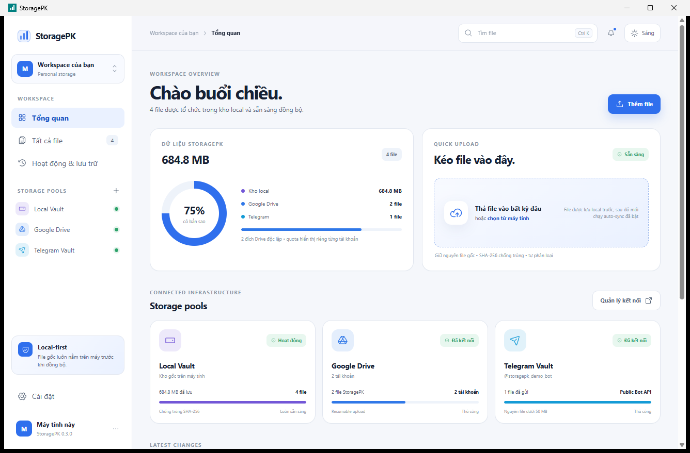
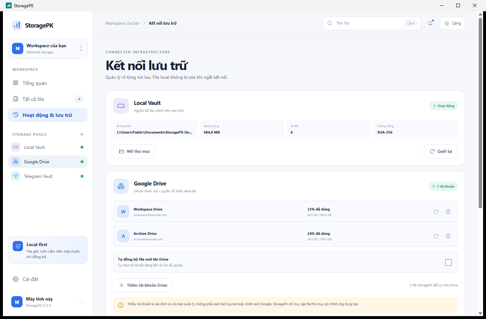
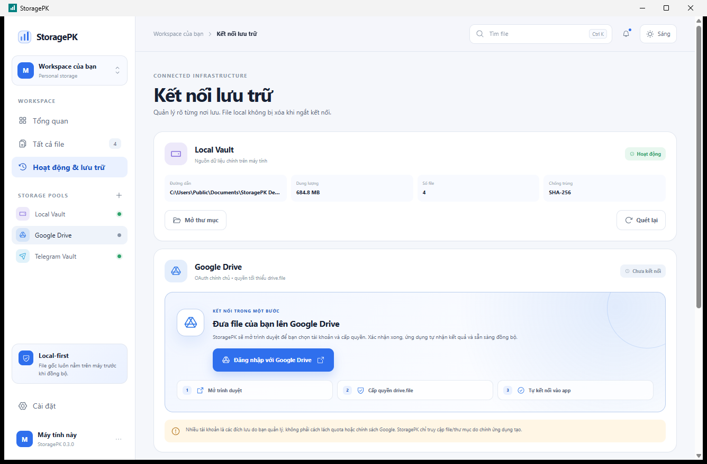

# StoragePK 0.3.0 Review

StoragePK `0.3.0` was published as the current GitHub release on 2026-07-27.

## Product

The Windows desktop app supports local file intake, classification, search, light/dark mode, multiple Google Drive accounts, and Telegram public Bot API backup.

Screenshots use generated demo data and contain no real credentials, account identifiers, Chat IDs, or personal paths.

## Verification

The release passed:

- production dependency audit;
- secret and PII scanning;
- TypeScript linting and type checks;
- API, web, worker, and provider behavior tests;
- 15 Rust integrity tests and Clippy with warnings denied;
- production builds for all workspaces;
- Windows GUI smoke launch;
- NSIS and MSI packaging;
- SHA-256 and CycloneDX SBOM generation.

## Disclosed Limits

- Windows binaries are currently unsigned.
- Google OAuth availability depends on the publisher consent project status.
- Telegram Local Bot API supervision is not implemented.
- The hosted web/API/worker stack is a foundation and is not operated as a public service by this repository.
