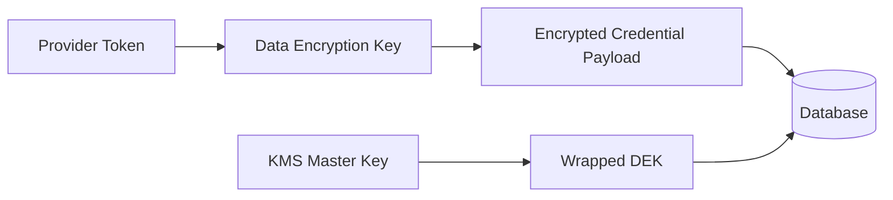

# Security - Encryption

## Purpose

Define encryption requirements for transport, stored metadata, provider credentials, staged bytes, backups, and AI-derived data.

## Scope

This document covers TLS, database encryption, application-level secret encryption, file staging, backups, and key management.

## Responsibilities

- Protect sensitive data at rest and in transit.
- Define key ownership and rotation.
- Ensure encryption does not break repairability.

## Assumptions

- Production uses TLS everywhere.
- Managed databases provide volume encryption.
- Application-level encryption is required for provider credentials and highly sensitive fields.

## Dependencies

- [secrets.md](secrets.md)
- [threats.md](threats.md)
- [../database/schema.md](../database/schema.md)

## Detailed Explanation

Encryption requirements:

| Data | Requirement |
| --- | --- |
| API traffic | TLS 1.2+ minimum, TLS 1.3 preferred. |
| WebSocket traffic | WSS only in production. |
| Provider credentials | Envelope encryption with KMS or master key outside DB. |
| Refresh tokens | Store hashed token identifiers, not raw tokens. |
| Staged upload bytes | Encrypted storage, short retention, access limited to workers. |
| Database | Managed at-rest encryption plus app-level encryption for secrets. |
| Backups | Encrypted, access-controlled, restore-tested. |
| AI transcripts | Encrypt if retained; redact sensitive context where possible. |

Provider credential encryption:

Key rotation:

- Rotate master keys on schedule or incident.
- Rewrap data keys without decrypting all payloads when supported.
- Rotate provider tokens after suspected exposure.
- Audit every credential decrypt operation.

## Edge Cases

- Worker needs credentials to upload; decrypt only in memory and redact logs.
- Local development cannot use production secrets; use isolated test providers.
- Backup restore must include key availability plan.
- Encryption failure must block provider operations rather than storing plaintext.

## Future Considerations

- Add end-to-end encrypted vault mode.
- Add per-workspace encryption keys.
- Add hardware-backed key storage for desktop local queue.

