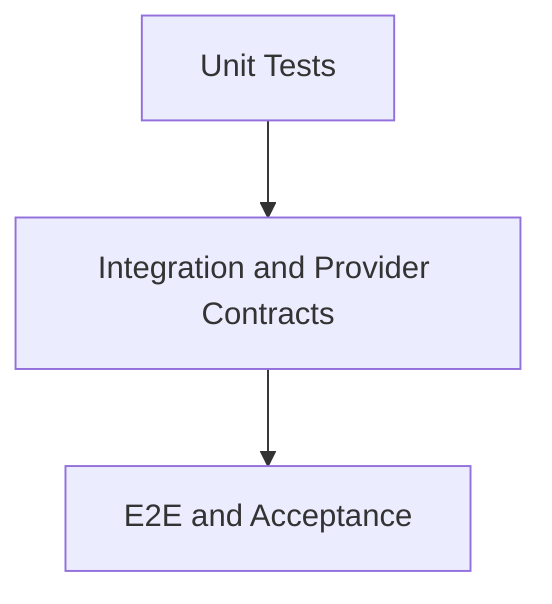

# Testing - Strategy

## Purpose

Define the overall testing strategy for StoragePK.

## Scope

This document covers unit, integration, e2e, performance, security, regression, acceptance, and manual verification.

## Responsibilities

- Align test depth with risk.
- Ensure file upload and provider behavior are verified.
- Provide release confidence before production.

## Assumptions

- Tests run in CI.
- Provider integrations use mocks for most tests and controlled test accounts for smoke tests.
- Documentation-only repository currently has no app tests.

## Dependencies

- [unit.md](unit.md)
- [integration.md](integration.md)
- [e2e.md](e2e.md)
- [../deployment/ci-cd.md](../deployment/ci-cd.md)

## Detailed Explanation

Testing pyramid:

Required categories:

| Category | Purpose |
| --- | --- |
| Unit | Validate services, validators, state machines, and provider adapters with mocks. |
| Integration | Validate DB, queues, search, auth, provider contract boundaries. |
| E2E | Validate full user workflows in web and desktop. |
| Performance | Validate upload, search, queue throughput, and indexing. |
| Security | Validate auth, authorization, injection, upload safety, AI leakage. |
| Regression | Protect fixed bugs and provider edge cases. |
| Acceptance | Confirm MVP workflows with persona scenarios. |

## Edge Cases

- Provider APIs can be flaky; smoke tests must distinguish provider outage from app regression.
- AI outputs are probabilistic; evaluate schema, permission, and grounding instead of exact prose.
- Desktop background upload needs restart/offline tests.
- Race conditions require targeted tests for duplicate uploads and job retries.

## Future Considerations

- Add load test suite.
- Add visual regression tests.
- Add accessibility test automation.

